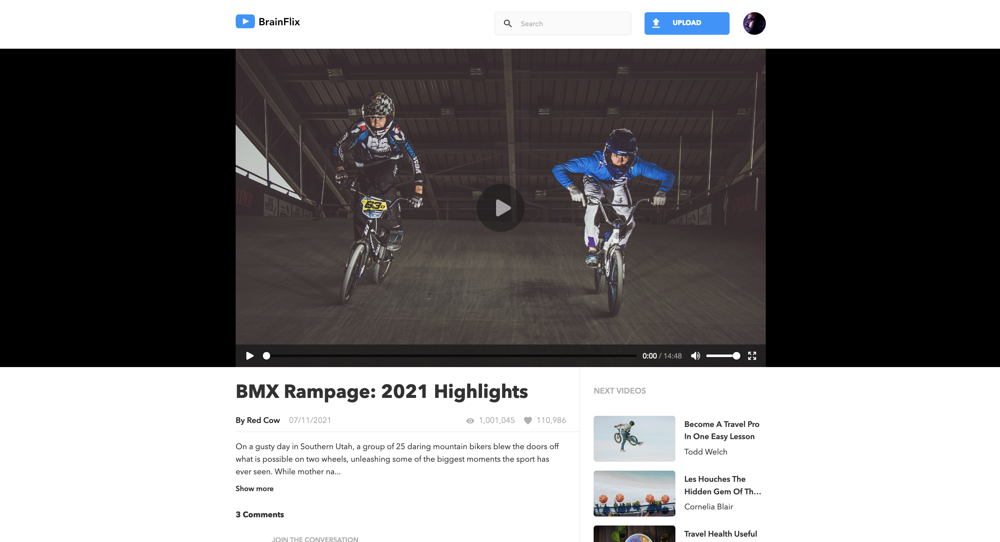
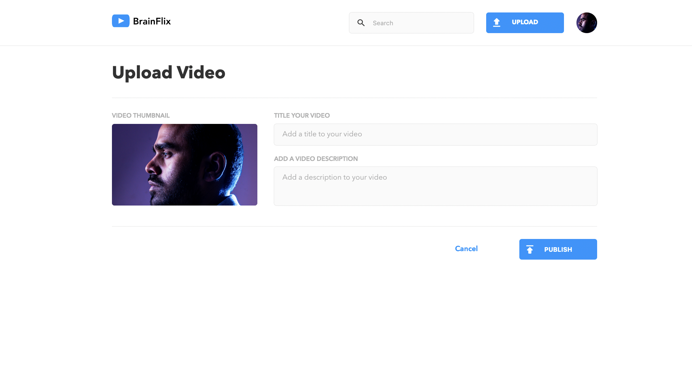

# BrainFlix

A single page application site for a video platform where users can post a new video and comment.

## Installation

```bash
  cd brainflix
  npm run install-all
  npm run dev
```

## Tech Stack

**Client:** React, Sass
**Server:** Node, Express

## Screenshots





## Acknowledgements

All the mockups and functional requirements are provided by BrainStation
